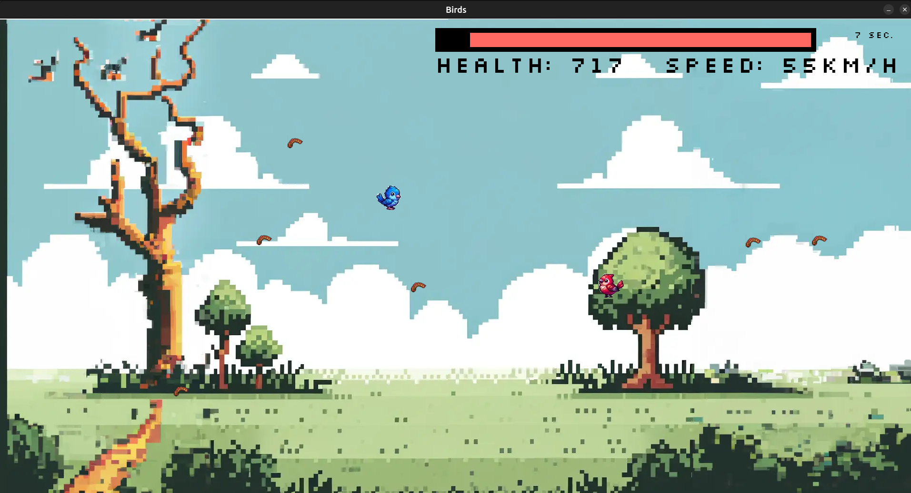

# Birds

## Dependencies

    - pygame

## Install

clone git repo:
    ```
    git clone https://github.com/cahir614/Birds.git
    ```

run with
    ```
    python3 main.py
    ```
or
    ```
    ./main.py
    ```

## Controls

### Player 1

    W - Up
    A - Left
    S - Down
    D - Right

### Player 2

    Arrow Up    - Up
    Arrow Left  - Left
    Arrow Down  - Down
    Arrow Right - Right



## Mechanics

    - Heath drains all the time
    - Health determines the speed of your Birds 
    - Collect Food to restore Health
